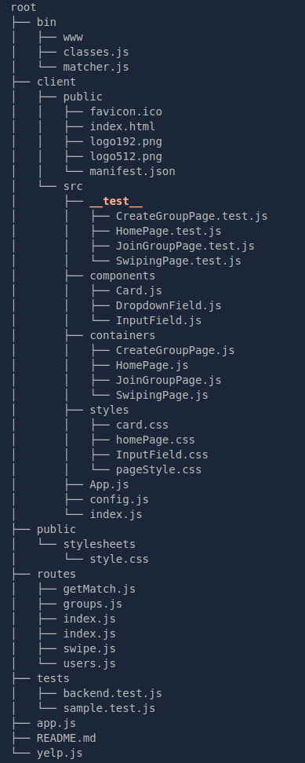

# UCLA-CS-130-Group4 -- "Chicken Tinder"
A more creative & efficient way to find restaurants when eating in groups.
### Project Directory Structure


### Backend Quickstart (from repo root directory)
* `npm install`
* `npm start`
* Open http://localhost:3001/

### Frontend Quickstart (from repo root directory)
* Open 1st terminal to start Redis server
    1. `$ redis-server`
    2. If redis port already occupied, `$ redis-cli shutdown` and retry step 1
* Open 2nd terminal to start Client
    1. `$ cd client`
    2. `$ npm install`
    3. `$ npm start`
    4. You should be automatically directed to http://localhost:8000

### Instructions to install Redis (from repo root directory)
* `$ npm install ioredis`   //this command will install redis client for node.js
* Now to install Redis server
    * Mac: `$ brew install redis`
    * Others (make sure you have GCC compiler and libc):
        ```sh
        $ wget http://download.redis.io/redis-stable.tar.gz
        $ tar xvzf redis-stable.tar.gz
        $ cd redis-stable
        $ make
        ```
    * Test if Redis server is working
        * In a new terminal, `$ redis-cli ping`
        * You should see `PONG`
        
Look at the app.js (backend) to see how to connect to redis server from node.js
* For more info about setting up Reids:  https://redis.io/topics/quickstart
* For more info about npm ioredis: https://www.npmjs.com/package/ioredis


## Testing (from root directory)
* Frontend
    * `$ cd client`
    * `$ npm install`
    * `$ npm run test`
    * Press `a` to run all tests

* Backend
    * `$ npm install`
    * `$ npm test`


