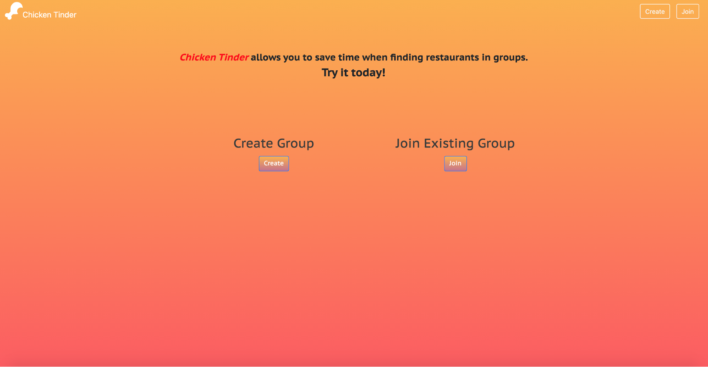

# Chicken Tinder

A more creative & efficient way to find restaurants when eating in groups.

<p float="left">
    
    
     
</p>



### Project Directory Structure

```bash
.
├── app.js                      # Configure Express backend + routes to add seed data
├── bin
│   └── www                     # Script to start Express web server
├── classes
│   ├── classes.js              # Implementation of Users, Groups, and Restaurants classes
│   └── matcher.js              # Matching algorithm
├── client
│   ├── package.json            # Metadata/dependencies for frontend React app
│   ├── public
│   │   ├── favicon.ico
│   │   ├── index.html          # HTML for single page React app
│   │   ├── logo192.png
│   │   ├── logo512.png
│   │   ├── manifest.json       # Metadata for single page React app
│   │   └── robots.txt          # robots.txt for single page React app
│   ├── README.md               # README for frontend client
│   ├── src
│   │   ├── App.js                  # Root App component for single page React app
│   │   ├── components
│   │   │   ├── Card.js             # Card component
│   │   │   ├── DropdownField.js    # DropdownField component
│   │   │   └── InputField.js       # InputField component
│   │   ├── config.js                   # Config for "State" dropdown field options
│   │   ├── containers
│   │   │   ├── CreateGroupPage.js      # CreateGroupPage container
│   │   │   ├── HomePage.js             # HomePage container
│   │   │   ├── JoinGroupPage.js        # JoinGroupPage container
│   │   │   └── SwipingPage.js          # SwipingPage container
│   │   ├── index.js                    # Script for React app entry point
│   │   ├── styles
│   │   │   ├── card.css                # CSS styles for Card
│   │   │   ├── homePage.css            # CSS styles for Home Page
│   │   │   ├── InputField.css          # CSS styles for Input Field
│   │   │   └── pageStyle.css           # CSS styles for All Pages
│   │   └── __test__
│   │       ├── CreateGroupPage.test.js     # Tests for CreateGroupPage (jest-dom)
│   │       ├── HomePage.test.js            # Tests for HomePage (jest-dom)
│   │       ├── JoinGroupPage.test.js       # Tests for JoinGroupPage (jest-dom)
│   │       └── SwipingPage.test.js         # Tests for SwipingPage (jest-dom)
│   └── yarn.lock
├── dump.rdb
├── package.json                            # Metadata/dependencies for backend Express app
├── README.md                               # README for root project directory
├── routes
│   ├── getMatch.js             # getMatch Express Router: Handles checking for match
│   ├── groups.js               # groups Express Router: Handles creating group, Yelp API query
│   ├── index.js                # index Express Router: Handles sending React app on index route
│   ├── swipe.js                # swipe Express Router: Handles swiping on a restaurant
│   └── users.js                # users Express Router: Handles adding user to a group
├── tests
│   ├── backend.test.js         # Tests for backend express app (jest/supertest)
│   └── sample.test.js
└── yelp.js                     # API Key for the Yelp Fusion Business Search API
```

## How to run Chicken Tinder locally

Note: these steps assume you have Node.js and npm installed. You can install both by downloading and running the installer [here](https://nodejs.org/en/download/).

#### Step 1: Clone this repository

1. Run `$ git clone https://github.com/sdulaney/UCLA-CS-130-Group4.git`

#### Step 2: Install Redis locally

1. Install Redis server

   - Mac:
     Run `$ brew install redis`
   - Others (make sure you have GCC compiler and libc):

   ```sh
   $ wget http://download.redis.io/redis-stable.tar.gz
   $ tar xvzf redis-stable.tar.gz
   $ cd redis-stable
   $ make
   ```

2. Test if Redis server is working
   - In a new terminal, Run `$ redis-cli ping`
   - You should see `PONG`

#### Step 3: Run Redis locally (Note: you will not be able to run Backend without starting Redis)

1. Open 1st terminal window to start Redis server

2. Run `$ redis-server`

Note: If redis port already occupied, Run `$ redis-cli shutdown` and retry previous command

Note: The database listens on port 6379 and it's contents can be viewed using the [TablePlus GUI for Redis](https://tableplus.com/)

#### Step 4: Run the backend Express app web server

1. Open 2nd terminal window in repo root directory

2. Run `$ npm install`
3. Run `$ npm start`

Note: The backend listens on port 3001 and can be accessed via http://localhost:3001/

#### Step 5: Run the frontend React app client

1. Open 3rd terminal window in repo root directory
2. Run `$ cd client`
3. Run `$ npm install`
4. Run `$ npm start`
5. Navigate to http://localhost:8000 in your web browser

## How to run the automated tests locally

#### Frontend

1. Run `$ cd client`
2. Run `$ npm install`
3. Run`$ npm run test`, then press `a` to run all tests

#### Backend

1. Run `$ npm install`
2. Run `$ npm test`

<div align="left">
 <h3 align="left">Tip: the meme changes if you refresh the page</h1>
 
</div>
